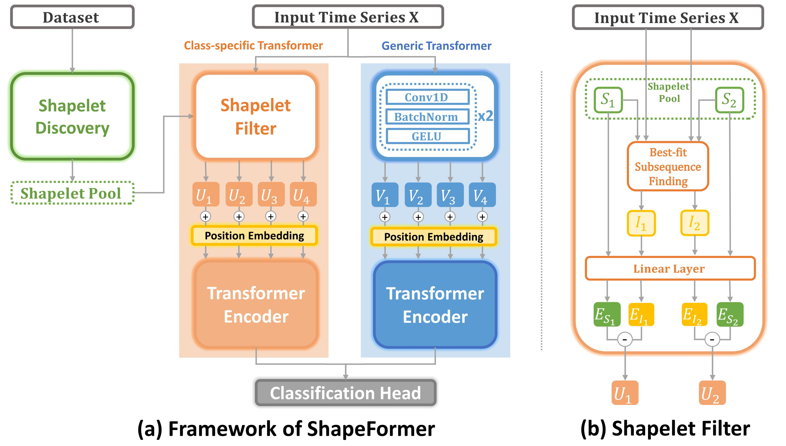

## ShapeFormer: Shapelet Transformer for Multivariate Time Series Classification (New Version Updating)

## Introduction
Multivariate time series classification (MTSC) has attracted significant research attention due to its diverse real-world applications. Recently, exploiting transformers for MTSC has achieved state-of-the-art performance. However, existing methods focus on generic features, providing a comprehensive understanding of data, but they ignore class-specific features crucial for learning the representative characteristics of each class. This leads to poor performance in the case of imbalanced datasets or datasets with similar overall patterns but differing in minor class-specific details. In this paper, we propose a novel Shapelet Transformer (ShapeFormer), which comprises class-specific and generic transformer modules to capture both of these features. In the class-specific module, we introduce the discovery method to extract the discriminative subsequences of each class (i.e. shapelets) from the training set. We then propose a Shapelet Filter to learn the difference features between these shapelets and the input time series. We found that the difference feature for each shapelet contains important class-specific features, as it shows a significant distinction between its class and others. In the generic module, convolution filters are used to extract generic features that contain information to distinguish among all classes. For each module, we employ the transformer encoder to capture the correlation between their features. As a result, the combination of two transformer modules allows our model to exploit the power of both types of features, thereby enhancing the classification performance. Our experiments on 30 UEA MTSC datasets demonstrate that ShapeFormer has achieved the highest accuracy ranking compared to state-of-the-art methods.

## Architecture 
The general architecture of ShapeFormer.



### Shapelet discovery
```
python cpu_main.py --dataset_pos=[dataset_pos] --window_size=[window_size]
```

### Model training
```
python main.py --dataset_pos=[dataset_pos] --num_shapelet=[num_shapelet] --window_size=[window_size]
```

Here, [dataset_pos], [num_shapelet] and [window_size] can be selected as follows:

| Dataset                   | [dataset_pos] | [window_size] | [num_shapelet] |
|---------------------------|---------------|---------------|----------------|
| ArticularyWordRecognition | 0             | 50            | 10             |
| AtrialFibrillation        | 1             | 100           | 3              |
| BasicMotions              | 2             | 100           | 10             |
| CharacterTrajectories     | 3             | 50            | 3              |
| Cricket                   | 4             | 200           | 30             |
| DuckDuckGeese             | 5             | 10            | 100            |
| ERing                     | 6             | 50            | 100            |
| EigenWorms                | 7             | 10            | 10             |
| Epilepsy                  | 8             | 20            | 30             |
| EthanolConcentration      | 9             | 200           | 100            |
| FaceDetection             | 10            | 10            | 10             |
| FingerMovements           | 11            | 20            | 30             |
| HandMovementDirection     | 12            | 200           | 100            |
| Handwriting               | 13            | 20            | 30             |
| Heartbeat                 | 14            | 200           | 100            |
| InsectWingbeat            | 15            | 10            | 30             |
| JapaneseVowels            | 16            | 10            | 1              |
| LSST                      | 17            | 20            | 10             |
| Libras                    | 18            | 10            | 30             |
| MotorImagery              | 19            | 100           | 30             |
| NATOPS                    | 20            | 20            | 1              |
| PEMS-SF                   | 21            | 50            | 10             |
| PenDigits                 | 22            | 4             | 10             |
| PhonemeSpectra            | 23            | 20            | 30             |
| RacketSports              | 24            | 10            | 10             |
| SelfRegulationSCP1        | 25            | 100           | 100            |
| SelfRegulationSCP2        | 26            | 100           | 100            |
| SpokenArabicDigits        | 27            | 10            | 100            |
| StandWalkJump             | 28            | 10            | 100            |
| UWaveGestureLibrary       | 29            | 10            | 10             |


